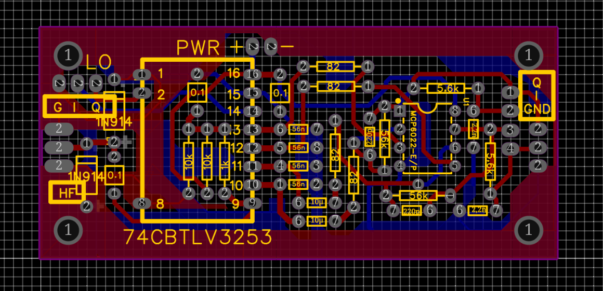

A Tayloe Detector Without SMD components
========================================

This detector was built using traditional (through-hole) components in order to carry out tests and measurements on PicoRX. It includes the latest improvements to the receiver (anti-aliasing).

